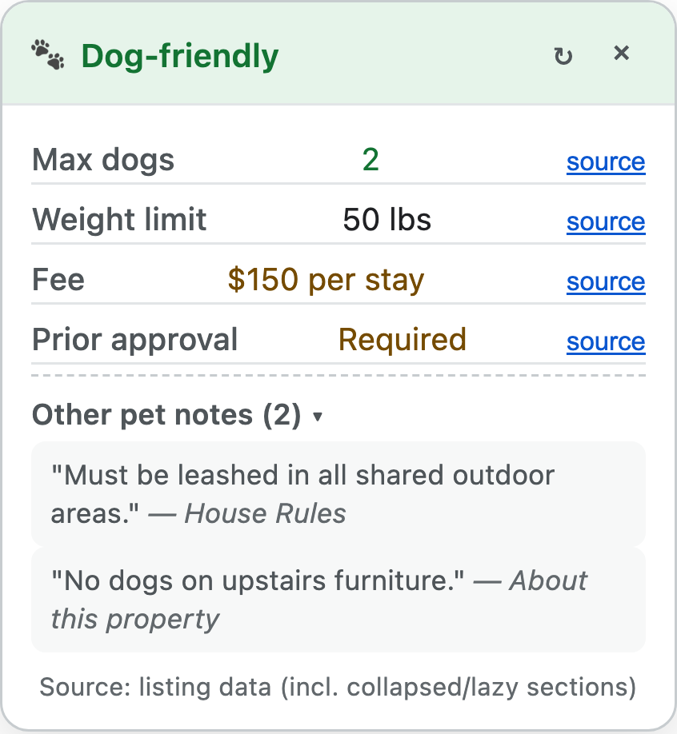

# Vrbow: Vrbo Dog Policy Callout

**A Chrome extension that extracts pet rules from Vrbo listings and shows them in a summary card.**

 

---

## Why?

Vrbo does not present pet policies in a consistent place. Hosts may put restrictions in House Rules, Amenities, or About this property, sometimes behind collapsed sections. Rules can also conflict within the same listing.

A property marked Pets allowed may still have limits on dog count, weight, fees, breeds, or require prior host approval. Checking all of this manually across several listings gets tedious quickly.

## What

The extension reads the pet policy information available on a listing and consolidates it into a summary showing:

- Whether dogs are allowed
- Maximum number of dogs and weight limits
- Pet fees or deposits
- Registration or prior approval requirements
- Other restrictions, such as breed or leash rules

Where possible, extracted rules link back to the source text on the listing, with the relevant text highlighted. If two sections contain conflicting rules, the extension flags the discrepancy rather than attempting to decide which one is authoritative.

## Search Result Badges

The extension can also add pet policy badges directly to Vrbo search results, making it easier to compare properties without opening each listing.

Search enrichment is disabled by default because it requires additional requests to retrieve policy details for individual properties. Enable it when useful and disable it when you no longer need it.

When enabled, the extension uses caching, request throttling, deduplication, and bounded concurrency to reduce redundant requests and avoid placing unnecessary load on Vrbo.

## Privacy

Processing and storage remain local to your browser. No personal data, browsing activity, or telemetry is sent to an external service.

The interface automatically follows your system light or dark theme.

---

## Installation

1. Download **`vrbow-v1.1.1.zip`** from [Releases](https://github.com/curdriceaurora/vrbow/releases).
2. Unzip the file into a folder on your computer.
3. Open `chrome://extensions` in your browser.
4. Turn on **Developer mode** in the top-right corner.
5. Click **Load unpacked** in the top-left corner.
6. Select the unzipped folder.

---

## How to Use

### 1. Automatic On-Page Card
When you visit a listing on `vrbo.com`, the policy card opens in the top-right corner:

- **Source verification**: Click the **source** link next to any value to highlight the original text on the page.
- **Other pet notes**: Click **Other pet notes** to read extra guidelines (such as leash rules or crate requirements).
- **Contradiction alerts (⚠️)**: The card alerts you if the host wrote conflicting rules in different sections.
- **Rescan (↻)**: Click the refresh icon to re-run extraction if a listing loads slowly.
- **Data Source**: The footer shows if data came from structured listing data or visible page text.

### 2. Browser Toolbar Popup
- Pin the extension icon to your Chrome toolbar.
- Click the extension icon on any active Vrbo listing to view the dog policy summary.

### 3. Search Results Badging
When you browse search results on `vrbo.com`:

- **Inline Badges**: The extension shows a compact badge on each search card:
  - 
  - 
  - 
  - 
  - 
  - 
- **Controlled Retrieval**: The extension fetches listing details with a controlled queue (maximum 2 requests, 400 ms safety delay) to prevent rate limits.
- **Fast Path & 24-Hour Cache**: Reads search-page data immediately when available and saves extracted policies in browser storage for 24 hours.

---

## Scope and Alternatives

- **Vrbo Only**: This extension operates only on `vrbo.com` property listings. It does not run on Airbnb, Expedia, or other booking websites.
- **Search Alternative**: To search across properties with custom pet filters (such as dog weight, pet count, or fee limits), use [BringFido](https://www.bringfido.com).

## Development and Support

- **AI Vibecoded**: This project was built and vibecoded with AI.
- **As-Is Software**: The extension works as intended. The author provides no guarantee of ongoing support, updates, or maintenance.

---

- [Release Notes & Changelog](CHANGELOG.md)
- [Privacy Policy](PRIVACY.md)
- [License](LICENSE)

> **Note**: Vrbow is an independent open-source tool. It is not affiliated with or endorsed by Vrbo or Expedia Group. No support is guaranteed. Always verify the host's original house rules before you book a property.
