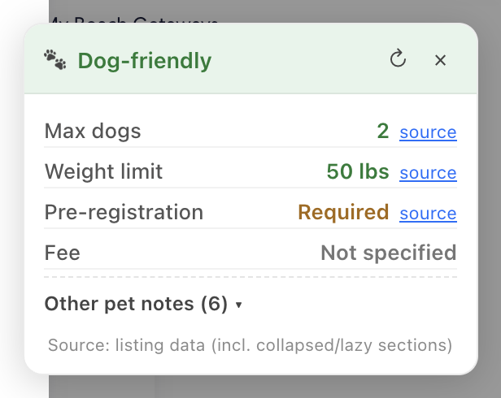
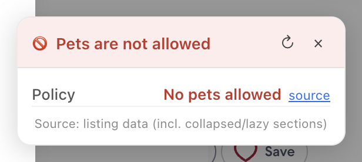
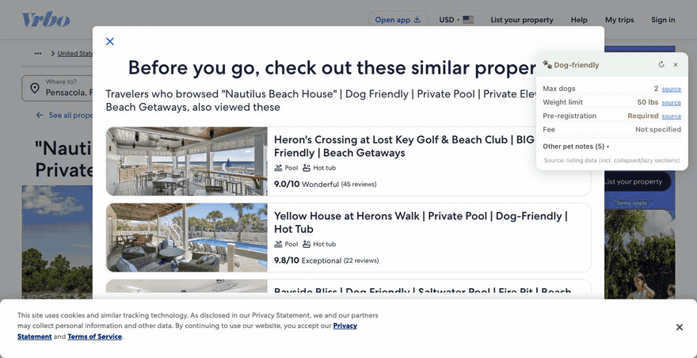
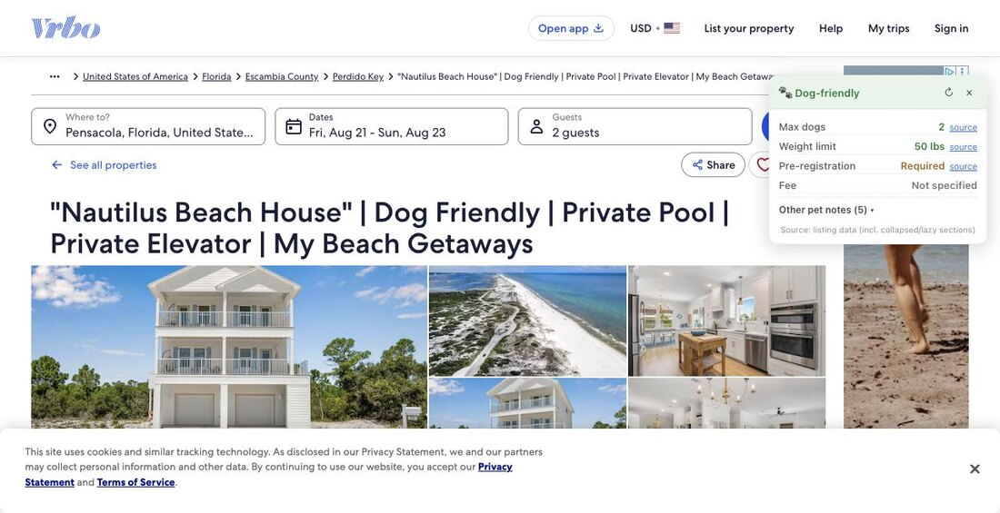

# Vrbo Dog Policy Callout

A Chrome extension that pulls the dog rules out of a Vrbo listing and puts
them in one always-visible card — instead of leaving them scattered across
House Rules, Amenities and "About this property".



Every value has a **source** link that jumps to and highlights the exact
sentence it came from, so you can check anything before booking.

## What it shows

- Whether pets are allowed
- Max number of dogs, and the per-dog weight limit
- Whether the host needs advance notice or pre-registration
- Pet fee, and any refundable deposit shown separately
- **Other pet notes** — breed limits, crate and leash rules, anything that
  doesn't fit a field above, so nothing is silently dropped

When a listing contradicts itself — and hosts do this more than you'd
expect — the card flags it rather than quietly picking one number:

> ⚠ Listing also states elsewhere: **75 lbs** (About this property)



Conditional wording is handled: *"no pets over 30 lbs"* and *"no pets
without prior approval"* mean pets **are** allowed with a condition, and
are not reported as a ban. Neither is *"no pet fee"*.

## In use

It appears on its own, a second or two after the listing loads — no
clicking, no scrolling down to House Rules.



It sits out of the way in the corner, over the listing you were reading:



## Install

Not on the Web Store — load it unpacked:

1. Open `chrome://extensions` (Chrome 111+).
2. Turn on **Developer mode**, top right.
3. Click **Load unpacked** and pick this folder.
4. Open any `vrbo.com` listing. The card appears on its own.

## Using it

- **source** — jumps to the sentence a value came from and highlights it.
- **Other pet notes** — click to expand the sentences that didn't map to a field.
- **↻** — rescan, if a listing was still loading.
- **×** — dismiss. Click the header to collapse it instead.
- The toolbar icon shows the same summary in a popup.

The footer says where the answer came from — the listing's own data, or
visible page text only.

## How it reads the page

Vrbo lazy-mounts House Rules and clamps the description behind "See more",
but the full text is already in the page's `__APOLLO_STATE__` when the
listing loads. The extension reads that directly, so it doesn't depend on
you scrolling or expanding anything, and it walks the *whole* listing
object rather than just the Pets row — which is how it catches a weight
limit in Amenities disagreeing with one in House Rules. If that data ever
disappears, it falls back to scanning visible page text.

Nothing is sent anywhere. It reads only what the page already loaded.

## Known limitations

- Extraction is regex-based. Unusual phrasing lands in "Other pet notes"
  rather than a structured field — deliberately, since showing you the raw
  sentence beats guessing wrong.
- **English only.** `kg` weights and `€`/`£`/`A$`/`NZ$` fees parse, so
  Stayz and Bookabach work, but every phrase it keys off ("up to", "pet
  fee", "prior approval") is English. German and French prose on
  FeWo-direkt and Abritel will mostly land in the notes.
- Only Vrbo.com is tested against live listings; the sister sites are
  best-effort.

## Ideas for later

- Pet policy badges directly on search-results cards.
- A way to flag a wrong extraction, to improve pattern coverage.

## Development

`extract.js` holds the parsing layer, deliberately free of DOM and
`chrome.*` calls so it can be unit-tested under Node. `page-bridge.js`
runs in the page's own JS world to reach `__APOLLO_STATE__`;
`content.js` merges that with visible text and renders the card.

```
node --check content.js && node --check extract.js && node --check page-bridge.js && node --check popup.js && node --test
```

34 offline tests and JavaScript syntax checks with zero dependencies, no Chrome, and no network. Enforced automatically in CI via the `offline-tests` GitHub Actions workflow. See [docs/testing.md](docs/testing.md) for the live harness that drives real listings.
